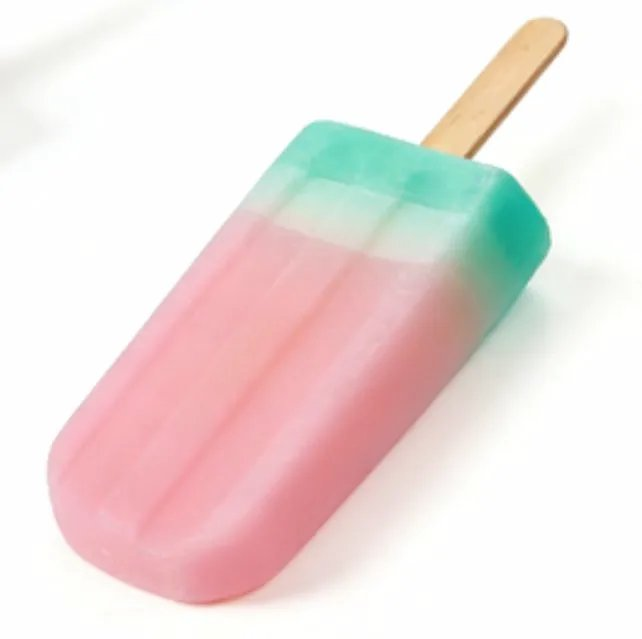

# Bath Mira Product Catalog — Master SKILL.md

> **用途**：本文档是 Bath Mira Industrial Co Ltd 所有产品目录网站的制作标准。  
> 每次制作或更新任何产品目录时，必须完全遵照此文档。  
> 适用于 Claude、Cursor、Windsurf、GitHub Copilot 等所有 AI 编程工具。

---

## 0. 固定品牌信息（永远不变，不要向用户询问）

| 字段 | 值 |
|---|---|
| 公司名 | Bath Mira Industrial Co Ltd |
| 联系邮箱 | kenpassion8@gmail.com |
| 网站域名格式 | `{产品类别}.bathmira.com` |
| 版权年份 | 当前年份（如 2026） |

---

## 1. 产品编号系统（最重要！必须严格遵守）

### 规则
- 所有产品共用**同一个全局编号序列**，格式为 `BM001`, `BM002`, `BM003` ...
- 编号**跨品类连续**，不同品类不重置编号
- 每次新增产品，必须从上一次的**最大编号 +1** 开始

### 示例流程

| 批次 | 品类 | 新增数量 | 编号范围 |
|---|---|---|---|
| 第1批 | 皂（Soap） | 11款 | BM001 – BM011 |
| 第2批 | 浴盐球（Bath Bomb） | 13款 | BM012 – BM024 |
| 第3批 | 新增皂 | 26款 | BM025 – BM050 |
| 第4批 | 沐浴球（Shower Steamer） | N款 | BM051 – BM0XX |

### 如何确认起始编号
每次用户提出新增产品时，**必须先告知或确认当前最大编号**，然后从下一个开始。
- 用户会提供（或已知）当前最大编号，例如 "上次做到 BM024"
- 若用户未说明，AI 必须主动询问："上次最后的编号是多少？"
- **严禁从 BM001 重新开始**（除非这是第一批产品）

---

## 2. 产品类别与对应网站

每个产品类别是**独立的 HTML 文件**，对应独立的子域名。

| 产品类别 | 网站标题 | 子域名 | Emoji |
|---|---|---|---|
| 皂 Soap | Artisan Soap Catalog | soap.bathmira.com | 🧼 |
| 浴盐球 Bath Bomb | Bath Bomb Collection | bathbomb.bathmira.com | 🛁 |
| 沐浴锭 Shower Steamer | Shower Steamer Catalog | showersteamer.bathmira.com | 🌿 |
| 蜡烛 Candle | Candle Collection | candle.bathmira.com | 🕯️ |
| 其他新品类 | {品类名} Catalog | {品类英文}.bathmira.com | 适当 emoji |

> 如果用户提到新品类，AI 自动套用此命名规则，无需询问。

---

## 3. 网页布局规范（必须严格按照此布局）

### 3.1 整体结构

```
┌─────────────────────────────────────────────┐
│ NAVBAR：左=公司名（大写加粗）  右=邮箱（加粗）│
├─────────────────────────────────────────────┤
│ HERO：大标题（如 Artisan Soap Catalog）      │
│       细线分隔符（菱形装饰线）               │
├─────────────────────────────────────────────┤
│ 产品网格：4列，每格 1:1 正方形              │
│  [BM001] [BM002] [BM003] [BM004]            │
│  [BM005] [BM006] [BM007] [BM008]            │
│  ...                                         │
├─────────────────────────────────────────────┤
│ FOOTER：版权信息 + 邮箱                     │
└─────────────────────────────────────────────┘
```

### 3.2 字体（必须使用 Google Fonts 引入）

| 用途 | 字体 | 说明 |
|---|---|---|
| 大标题（Hero） | Playfair Display | serif，优雅感 |
| 导航栏、按钮 | Raleway | sans-serif，现代感 |
| 产品编号 | Libre Baskerville | serif + bold，清晰 |

```html
<link rel="preconnect" href="https://fonts.googleapis.com">
<link href="https://fonts.googleapis.com/css2?family=Playfair+Display:wght@400;700&family=Raleway:wght@400;600;700&family=Libre+Baskerville:wght@400;700&display=swap" rel="stylesheet">
```

### 3.3 导航栏（Header）

```css
/* 规格 */
height: 56px;
padding: 0 44px;
display: flex;
justify-content: space-between;
align-items: center;
border-bottom: 0.5px solid #e0d9cf;
background: #fff;
```

- **左侧**：公司名 `Bath Mira Industrial Co Ltd`
  - 字体：Raleway Bold，13px，字间距 0.18em，全大写
  - 颜色：`#1a1814`
- **右侧**：邮箱 `kenpassion8@gmail.com`
  - 字体：Raleway Bold，13px，字间距 0.08em
  - 颜色：`#1a1814`

### 3.4 Hero 区域

```
- 上下 padding：56px 40px 44px
- 小标题（eyebrow）：Raleway，9px，字重 500，字间距 0.3em，全大写
  - 颜色：#b5a898
  - 内容：Product Catalog · 2026
- 大标题字体：Playfair Display，48px，字重 600
- 颜色：#1a1814（深棕色）
- 大标题下方：细线装饰（方形钻石 + 横线）
```

**细线装饰 HTML**（固定，不要修改）：
```html
<div class="hero-eyebrow">Product Catalog &nbsp;·&nbsp; 2026</div>
<h1 class="hero-title">{CATALOG_TITLE}</h1>
<div class="hero-rule">
  <div class="hero-rule-line"></div>
  <div class="hero-rule-diamond"></div>
  <div class="hero-rule-line"></div>
</div>
```

```css
.hero-rule {
  display: flex;
  align-items: center;
  justify-content: center;
  gap: 10px;
}
.hero-rule-line {
  width: 40px;
  height: 0.5px;
  background: #c8b89a;
}
.hero-rule-diamond {
  width: 5px;
  height: 5px;
  border: 0.5px solid #c8b89a;
  transform: rotate(45deg);
}
```

### 3.5 产品网格

```css
.grid-wrap {
  padding: 44px;
}
.grid {
  display: grid;
  grid-template-columns: repeat(4, 1fr);  /* 固定4列 */
  gap: 0;  /* 无间隙，边框由卡片提供 */
}
```

**响应式断点**：
```css
@media (max-width: 800px) {
  .grid-wrap { padding: 20px; }
  .grid { grid-template-columns: repeat(2, 1fr); }
}
```

### 3.6 产品卡片（重要！图片规格严格统一）

```css
.card {
  display: flex;
  flex-direction: column;
  align-items: center;
  border-right: 0.5px solid #e0d9cf;
  border-bottom: 0.5px solid #e0d9cf;
}
.card:nth-child(4n) { border-right: none; }  /* 每行最后一个不显示右边框 */
.card:hover .card-img-wrap img {
  transform: scale(1.06);
}
```

**图片容器（核心规格）**：
```css
.card-img-wrap {
  width: 100%;
  aspect-ratio: 1 / 1;          /* 强制 1:1 正方形 */
  background: #f7f4f0;
  display: flex;
  align-items: center;
  justify-content: center;
  padding: 12%;                 /* 图片周围留白 */
  overflow: hidden;
}
.card-img-wrap img {
  width: 100%;
  height: 100%;
  object-fit: contain;          /* 保持比例，完整显示 */
  display: block;
  transition: transform 0.6s ease;
}
```

**产品编号标签**：
```css
.card-label {
  width: 100%;
  text-align: center;
  padding: 14px 8px 16px;
  font-family: "Libre Baskerville", serif;
  font-size: 13px;
  font-weight: 700;
  letter-spacing: 0.1em;
  color: #1a1814;
  border-top: 0.5px solid #e0d9cf;
}
```

> ⚠️ **关键**：无论用户上传的图片是正方形、横版还是竖版，
> 一律使用 `object-fit: contain` + `padding: 12%`，
> 确保**所有产品图片在视觉上大小一致、排列整齐**。

### 3.7 Footer

```html
<div class="footer">
  <div class="footer-text">Custom shapes &amp; sizes &nbsp;·&nbsp; OEM available</div>
  <div class="footer-text">&copy; 2026 Bath Mira Industrial Co Ltd</div>
</div>
```

```css
.footer {
  padding: 18px 44px;
  border-top: 0.5px solid #e0d9cf;
  display: flex;
  align-items: center;
  justify-content: space-between;
}
.footer-text {
  font-family: "Raleway", sans-serif;
  font-size: 9px;
  font-weight: 500;
  letter-spacing: 0.18em;
  text-transform: uppercase;
  color: #b5a898;
}
```

**响应式**：
```css
@media (max-width: 800px) {
  .footer {
    padding: 14px 20px;
    flex-direction: column;
    gap: 6px;
    text-align: center;
  }
}
```

---

## 4. 图片处理规范

### 4.1 图片存储方式（重要！）

**两种方式并存**：

1. **Base64 嵌入**（适用于初始产品）
   - 将图片转为 base64 直接嵌入 HTML
   - 格式：`data:image/jpeg;base64,...`
   - 优点：单文件部署，无需额外文件
   - 示例：BM001-BM011 使用此方式

2. **相对路径引用**（适用于后续新增产品）
   - 图片文件放在 `images/` 文件夹
   - HTML 中使用：``
   - 优点：文件体积小，易于更新
   - **必须使用无边框的压缩图片**（见 4.3）
   - 示例：BM012-BM020 使用此方式

### 4.2 图片统一显示
即使用户提供的图片大小、方向、分辨率不同，通过以下 CSS 确保视觉一致：
- `aspect-ratio: 1/1` — 容器强制正方形
- `object-fit: contain` — 图片完整显示，不裁切
- `padding: 12%` — 四周留白
- `background: #f7f4f0` — 统一浅米色背景

### 4.3 新增产品图片处理流程（重要！）

当添加新产品时，必须按以下步骤处理图片：

1. **压缩图片**（使用 Python PIL）
   ```python
   from PIL import Image

   def compress_image_no_border(input_path, output_path, size=(800, 800), quality=85):
       with Image.open(input_path) as img:
           if img.mode != 'RGB':
               img = img.convert('RGB')
           # 使用 thumbnail 保持比例
           img.thumbnail(size, Image.Resampling.LANCZOS)
           # 直接保存，不添加白色边框
           img.save(output_path, 'JPEG', quality=quality, optimize=True)
   ```

2. **保存到 images 文件夹**
   - 文件名格式：`BM012.jpg`, `BM013.jpg` ...
   - 必须是 **无边框** 的图片
   - 让 CSS 的 `padding: 12%` 来控制留白

3. **更新 HTML**
   ```html
   <div class="card">
     <div class="card-img-wrap">
       
     </div>
     <div class="card-label">BM012</div>
   </div>
   ```

4. **更新 product-registry.json**
   ```json
   {
     "lastProductNumber": "BM020",
     "processedFiles": ["微信图片_xxx.png", ...]
   }
   ```

⚠️ **关键注意事项**：
- 新图片 **不要添加白色边框**
- 使用 `thumbnail()` 而非 `resize()`，保持原始比例
- 图片周围的留白由 CSS `padding: 12%` 统一控制
- 这样可以确保新旧产品视觉大小一致

---

## 5. 完整 HTML 模板

以下是完整的单文件模板，每次制作新目录时复制此模板：

```html
<!DOCTYPE html>
<html lang="en">
<head>
  <meta charset="UTF-8">
  <meta name="viewport" content="width=device-width, initial-scale=1.0">
  <title>{CATALOG_TITLE} — Bath Mira Industrial Co Ltd</title>
  <link rel="preconnect" href="https://fonts.googleapis.com">
  <link href="https://fonts.googleapis.com/css2?family=Playfair+Display:wght@400;700&family=Raleway:wght@400;600;700&family=Libre+Baskerville:wght@400;700&display=swap" rel="stylesheet">
  <style>
    * { box-sizing: border-box; margin: 0; padding: 0; }
    body { background: #fff; color: #2c1810; }

    /* NAVBAR */
    .navbar {
      height: 64px; padding: 0 40px;
      display: flex; justify-content: space-between; align-items: center;
      border-bottom: 1px solid #e8e0d8;
      background: #fff; position: sticky; top: 0; z-index: 100;
    }
    .navbar-brand {
      font-family: 'Raleway', sans-serif; font-weight: 700;
      font-size: 14px; letter-spacing: 0.15em; color: #2c1810;
    }
    .navbar-email {
      font-family: 'Raleway', sans-serif; font-weight: 600;
      font-size: 13px; color: #8a7a6b;
    }

    /* HERO */
    .hero { text-align: center; padding: 60px 40px; }
    .hero-title {
      font-family: 'Playfair Display', serif; font-weight: 700;
      font-size: 48px; color: #2c1810; line-height: 1.2;
    }
    .hero-divider {
      display: flex; align-items: center; gap: 12px;
      margin: 20px auto; width: fit-content;
    }
    .hero-divider .line { width: 80px; height: 1px; background: #c9b8a8; }
    .hero-divider .diamond { color: #c9b8a8; font-size: 8px; }

    /* GRID */
    .product-grid {
      display: grid; grid-template-columns: repeat(4, 1fr);
      gap: 24px; padding: 40px; max-width: 1200px; margin: 0 auto;
    }
    @media (max-width: 900px) { .product-grid { grid-template-columns: repeat(3, 1fr); } }
    @media (max-width: 600px) { .product-grid { grid-template-columns: repeat(2, 1fr); } }

    /* CARD */
    .product-card {
      background: #fff; border: 1px solid #e8e0d8;
      border-radius: 8px; overflow: hidden; transition: box-shadow 0.2s;
    }
    .product-card:hover { box-shadow: 0 4px 20px rgba(0,0,0,0.08); }
    .product-image-wrapper {
      width: 100%; aspect-ratio: 1 / 1; background: #faf8f6;
      display: flex; align-items: center; justify-content: center;
      overflow: hidden; padding: 16px;
    }
    .product-image-wrapper img {
      width: 100%; height: 100%; object-fit: contain; display: block;
    }
    .product-id {
      font-family: 'Libre Baskerville', serif; font-weight: 700;
      font-size: 14px; color: #2c1810; text-align: center;
      padding: 12px 16px; letter-spacing: 0.05em;
    }

    /* FOOTER */
    footer {
      text-align: center; padding: 40px;
      border-top: 1px solid #e8e0d8;
      font-family: 'Raleway', sans-serif;
      font-size: 12px; color: #8a7a6b; margin-top: 40px;
    }
  </style>
</head>
<body>

  <nav class="navbar">
    <span class="navbar-brand">BATH MIRA INDUSTRIAL CO LTD</span>
    <span class="navbar-email">kenpassion8@gmail.com</span>
  </nav>

  <div class="hero">
    <h1 class="hero-title">{CATALOG_TITLE}</h1>
    <div class="hero-divider">
      <span class="line"></span>
      <span class="diamond">◆</span>
      <span class="line"></span>
    </div>
  </div>

  <div class="product-grid">

    <!-- 产品卡片模板（复制并修改） -->
    <div class="product-card">
      <div class="product-image-wrapper">
        
      </div>
      <div class="product-id">BM001</div>
    </div>

    <!-- 继续添加更多卡片... -->

  </div>

  <footer>
    © {YEAR} Bath Mira Industrial Co Ltd · kenpassion8@gmail.com
  </footer>

</body>
</html>
```

---

## 6. 新增产品的操作流程（SOP）

### 情况 A：新品类，第一次制作

1. 确认品类名称（皂 / 浴盐球 / 沐浴锭 / 其他）
2. 确认**起始编号**（询问：上次最大编号是多少？）
3. 用户上传所有产品图片
4. 将每张图片转为 base64 嵌入 HTML（初始产品推荐此方式）
5. 按上传顺序依次分配编号（BM00X, BM00X+1 ...）
6. 套用本文档模板，填入正确的 `{CATALOG_TITLE}`
7. 输出完整 HTML 文件，文件名建议：`catalog-final.html`

### 情况 B：同品类，新增产品（推荐使用相对路径）

1. 打开已有的 HTML 文件
2. 确认当前最大编号（查看 `product-registry.json` 或文件中最后一个 BM 编号）
3. 用户上传新产品图片到 `asset/` 文件夹
4. **压缩图片**（无边框，800x800，85% 质量）：
   ```python
   # 使用 compress_images_no_border.py
   python asset/compress_images_no_border.py
   ```
5. 将压缩后的图片移动到 `images/` 文件夹
6. 从最大编号 +1 开始分配新编号
7. 在产品网格末尾追加新卡片（使用相对路径）：
   ```html
   <div class="card">
     <div class="card-img-wrap">
       
     </div>
     <div class="card-label">BM012</div>
   </div>
   ```
8. 更新 `product-registry.json`
9. 输出完整更新后的 HTML 文件

### 情况 C：新品类，但已有其他品类

1. 询问：上次所有产品（含其他品类）的最大编号是多少？
2. 从最大编号 +1 开始
3. 创建全新 HTML 文件，使用新品类的标题

---

## 7. 各品类标题对照表

| 品类 | `{CATALOG_TITLE}` |
|---|---|
| 皂 | Artisan Soap Catalog |
| 浴盐球 | Bath Bomb Collection |
| 沐浴锭 | Shower Steamer Catalog |
| 蜡烛 | Candle Collection |
| 磨砂膏 | Scrub Catalog |
| 身体乳 | Body Lotion Collection |
| 新品类 | `{品类英文名} Catalog` |

---

## 8. AI 行为规范

### 必须做的
- ✅ 初始产品使用 base64 嵌入，新增产品使用相对路径（`images/` 文件夹）
- ✅ 新增产品图片必须是**无边框**的压缩版本（800x800，85% 质量）
- ✅ 产品卡片只显示编号（BM001 等），不显示名称或克重
- ✅ 图片统一使用 `object-fit: contain` + `padding: 12%`
- ✅ 固定4列网格（电脑版），响应式缩减至2列
- ✅ 输出完整 HTML 文件（不是代码片段）
- ✅ 文件名为 `catalog-final.html`
- ✅ 更新 `product-registry.json` 记录处理过的文件

### 禁止做的
- ❌ 不在产品卡片中显示产品名称、描述、价格、克重
- ❌ 不使用 imgur 或其他图片外链
- ❌ 不改变导航栏布局（公司名左，邮箱右）
- ❌ 不改变字体组合（Playfair + Raleway + Libre Baskerville）
- ❌ 不改变颜色系统（主色 #1a1814，边框 #e0d9cf，背景 #f7f4f0）
- ❌ 不在用户未要求时重置编号
- ❌ 不混合不同品类到同一个 HTML 文件中
- ❌ **不给新增的产品图片添加白色边框**（留白由 CSS padding 控制）
- ❌ 不改变颜色系统（主色 #1a1814，边框 #e0d9cf，背景 #f7f4f0）
- ❌ 不在用户未要求时重置编号
- ❌ 不混合不同品类到同一个 HTML 文件中

---

## 9. 颜色系统

| 变量 | 颜色值 | 用途 |
|---|---|---|
| 主文字色 | `#1a1814` | 标题、编号、品牌名 |
| 次文字色 | `#b5a898` | eyebrow、footer |
| 边框色 | `#e0d9cf` | 卡片边框、分隔线 |
| 图片背景 | `#f7f4f0` | 产品图片区域背景 |
| 装饰线色 | `#c8b89a` | Hero 细线装饰 |
| 页面背景 | `#ffffff` | 整体背景 |

---

## 10. 快速参考卡（给 AI 的检查清单）

在输出任何目录网站之前，逐项确认：

- [ ] `{CATALOG_TITLE}` 已替换为正确品类标题
- [ ] 编号从正确的 BM 序号开始（非 BM001 重置）
- [ ] 每张图片已 base64 嵌入
- [ ] 所有图片容器使用 `aspect-ratio: 1/1` + `object-fit: contain`
- [ ] Header 左=品牌名，右=邮箱
- [ ] Hero 有 eyebrow 小标题（Product Catalog · 2026）
- [ ] Hero 有方形钻石细线装饰（CSS transform: rotate(45deg)）
- [ ] 网格为4列，无间隙（gap: 0）
- [ ] 卡片只显示产品编号
- [ ] Footer 左=服务信息，右=版权年份
- [ ] 输出为完整 HTML 文件

---

*Last updated: 2026 · Bath Mira Industrial Co Ltd*
